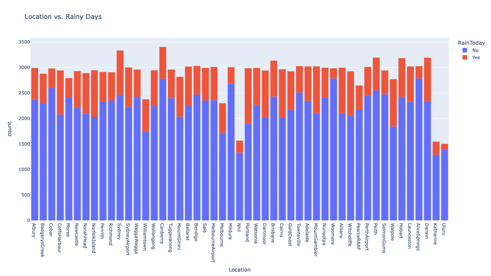
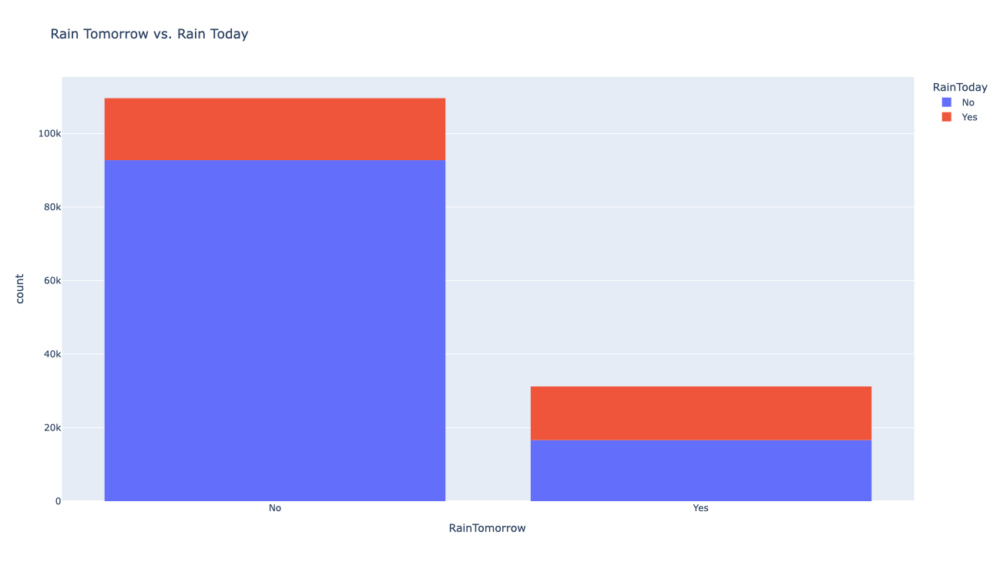
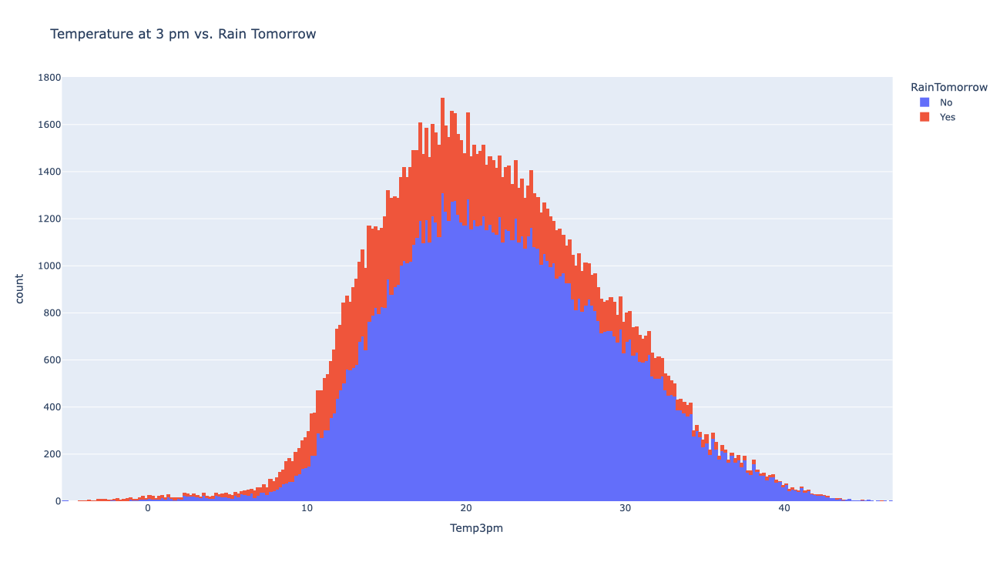
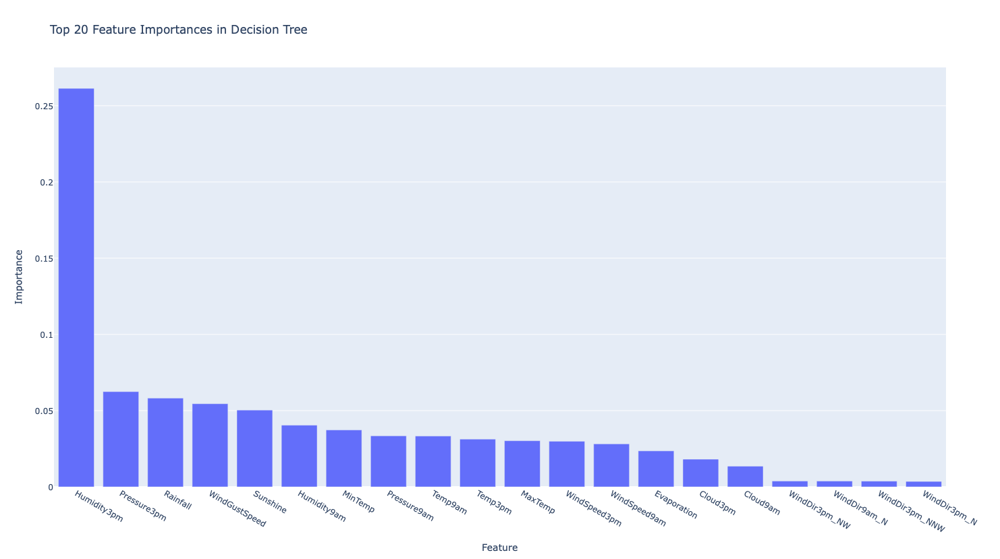

# 🌦️ Weather Prediction Using Logistic Regression & Decision Tree

This project predicts whether it will rain tomorrow in Australia using **10+ years of daily historical data**.  
It features two machine learning models — **Logistic Regression** and **Decision Tree Classifier** — built using Python and Scikit-Learn.  
The project includes full data preprocessing, feature engineering, visual analysis, and prediction evaluation.

---

## 📊 Dataset

**Source:** [Australian Weather Dataset – Kaggle](https://www.kaggle.com/datasets/jsphyg/weather-dataset-rattle-package)  
**Description:**  
The dataset contains more than **145,000 daily weather records** from multiple Australian weather stations, covering years **2008–2017**.  
It includes features such as temperature, humidity, wind speed, rainfall, evaporation, and pressure.

---

## ⚙️ Project Workflow

1. **Dataset Download:** via `opendatasets` from Kaggle.  
2. **Data Cleaning:** removed missing values in target columns (`RainToday`, `RainTomorrow`).  
3. **Imputation:** filled numeric missing values using `SimpleImputer(strategy='mean')`.  
4. **Scaling:** normalised numeric features using `MinMaxScaler`.  
5. **Encoding:** converted categorical data to numeric using `OneHotEncoder`.  
6. **Data Split:**  
   - **Training Data:** before 2015  
   - **Validation Data:** year 2015  
   - **Testing Data:** after 2015  
7. **Model Training:** built and trained both Logistic Regression and Decision Tree models.  
8. **Evaluation:** compared model performance on all three datasets.  
9. **Visualisation:** created multiple charts for exploratory data analysis.

---

## 📈 Visualisations and Insights

All visualisations are stored in the **`graphs/`** folder.

### 1️⃣ Location vs Rainy Days (Histogram)
Shows how rainfall frequency differs by Australian location.  
**Insight:** Coastal areas see rain far more often than inland regions. 
 


### 2️⃣ Rain Tomorrow vs Rain Today (Histogram)
Displays how rainfall today correlates with rainfall tomorrow.  
**Insight:** If it rains today, the chance of rain tomorrow rises sharply.  



### 3️⃣ Temperature at 3 pm vs Rain Tomorrow (Histogram)
Visualises how afternoon temperature affects the probability of rain the next day.  
**Insight:** Cooler afternoons tend to precede rainy days.  



### 4️⃣ Min Temperature vs Max Temperature (Scatter Plot)
Shows the relationship between daily minimum and maximum temperatures.  
**Insight:** As expected, they’re strongly positively correlated.  


### 5️⃣ Temperature (3 pm) vs Humidity (3 pm) (Scatter Plot)
Analyses how temperature interacts with humidity levels later in the day.  
**Insight:** High humidity and lower afternoon temperatures often lead to rain.  


### 6️⃣ Top 20 Feature Importances in Decision Tree (Bar Chart)
Displays the top predictors according to the Decision Tree model.  
**Insight:** Humidity, temperature, and wind features have the highest influence.  



---

## 🧠 Machine Learning Models

### 🔹 Logistic Regression
- Used for binary classification of "RainTomorrow".
- Applied after data normalisation and encoding.
- Provides interpretable results with probability estimates.
- Evaluated on training, validation, and test sets.

### 🔹 Decision Tree Classifier
- Captures non-linear relationships and interactions between variables.
- Feature importance scores used to analyse influential predictors.
- Tuned via different `max_leaf_nodes` values to reduce overfitting.

---

## 📚 Libraries Used

```python
import opendatasets as od
import pandas as pd
import numpy as np
import matplotlib.pyplot as plt
import seaborn as sns
import plotly.express as px
from sklearn.impute import SimpleImputer
from sklearn.preprocessing import MinMaxScaler, OneHotEncoder
from sklearn.linear_model import LogisticRegression
from sklearn.tree import DecisionTreeClassifier, plot_tree, export_text
from sklearn.metrics import accuracy_score, confusion_matrix
```

---

## 📊 Model Comparison

| Model                | Training Accuracy | Validation Accuracy | Test Accuracy | Notes |
|----------------------|------------------:|--------------------:|--------------:|-------|
| Logistic Regression  | ~82%              | ~79%                | ~79%          | Well-balanced and interpretable |
| Decision Tree        | ~100%             | ~77%                | ~77%          | Overfitting observed on training data |


---

## 🔍 Example Prediction

Example of predicting rainfall for a new day’s weather:

```python
new_input = {
    'Date': '2021-06-19',
    'Location': 'Katherine',
    'MinTemp': 23.2,
    'MaxTemp': 33.2,
    'Rainfall': 10.2,
    'Evaporation': 4.2,
    'Sunshine': np.nan,
    'WindGustDir': 'NNW',
    'WindGustSpeed': 52.0,
    'WindDir9am': 'NW',
    'WindDir3pm': 'NNE',
    'WindSpeed9am': 13.0,
    'WindSpeed3pm': 20.0,
    'Humidity9am': 89.0,
    'Humidity3pm': 58.0,
    'Pressure9am': 1004.8,
    'Pressure3pm': 1001.5,
    'Cloud9am': 8.0,
    'Cloud3pm': 5.0,
    'Temp9am': 25.7,
    'Temp3pm': 33.0,
    'RainToday': 'Yes'
}

prediction, probability = predict_input(new_input)
print(prediction, probability)
```

**Sample Output:**
```
Prediction: Yes
Probability: 0.82
```

---

## 🧮 Project Structure

```
Weather-Prediction-ML/
│
├── data/
│   └── weatherAUS.csv
│
├── models/
│   ├── logistic_regression.py
│   └── decision_tree.py
│
├── graphs/
│   ├── location_vs_rainy_days.png
│   ├── rain_tomorrow_vs_rain_today.png
│   ├── temp3pm_vs_rain_tomorrow.png
│   ├── min_temp_vs_max_temp.png
│   ├── temp3pm_vs_humidity3pm.png
│   └── top_20_feature_importances.png
│
├── requirements.txt
└── README.md
```

---

## 🚀 How to Run

1. **Clone the repository**
   ```bash
   git clone https://github.com/parthgrover18/Weather-Prediction-ML.git
   cd Weather-Prediction-ML
   ```

2. **Install required libraries**
   ```bash
   pip install -r requirements.txt
   ```

3. **Run the models**
   ```bash
   python models/logistic_regression.py
   python models/decision_tree.py
   ```

---

## 📦 Requirements

```txt
pandas
numpy
matplotlib
seaborn
plotly
scikit-learn
opendatasets
```

---

## 👨‍💻 Author

**Parth Grover**  
🎓 BSc Computer Science, University of West London  
📍 Based in the United Kingdom  
🔗 [LinkedIn](https://www.linkedin.com/in/parth-grover-4ab168232/) | [GitHub](https://github.com/parthgrover18)

---

## 🏷️ License

This project is for **educational and research purposes** only.  
Dataset © Kaggle & Australian Government Bureau of Meteorology.

---

## 💡 Future Improvements

- Add **Random Forest** or **XGBoost** for improved accuracy and stability.  
- Implement **cross-validation** and **hyperparameter tuning**.  
- Develop a **Streamlit or Flask web app** for interactive weather prediction.  
- Use **SHAP values** or **LIME** for better model explainability.
